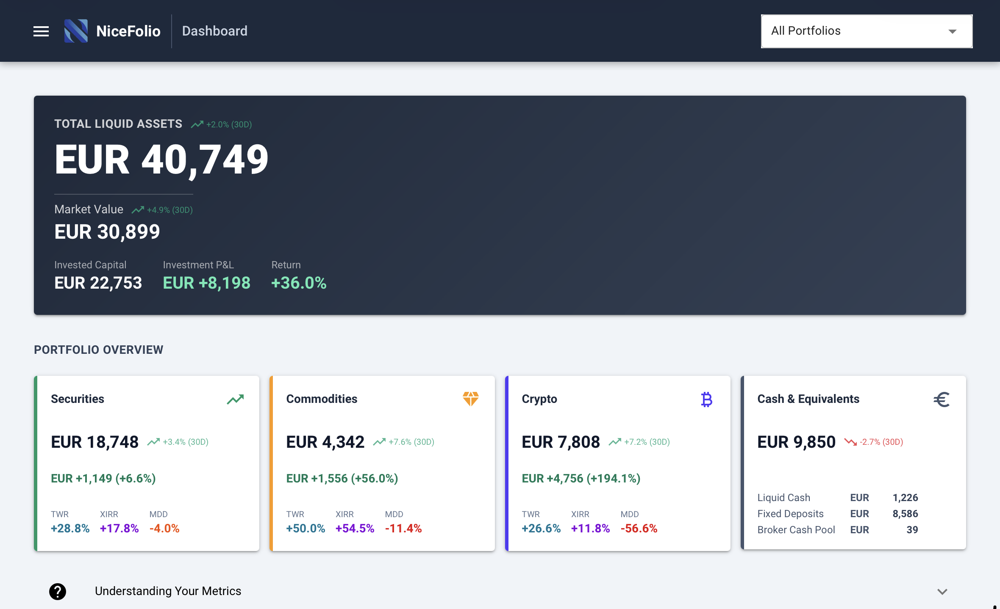
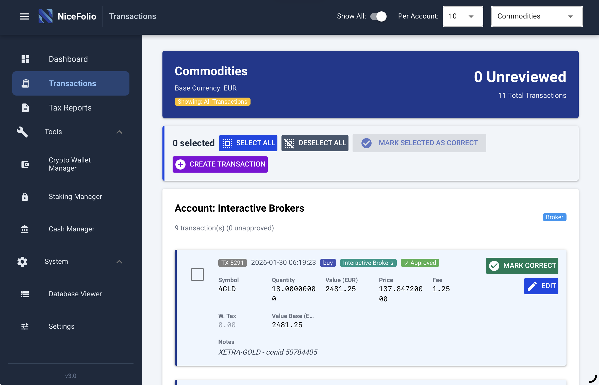

# NiceFolio

**A full-stack, multi-asset portfolio tracking system built with Python — 43,000+ lines of production code across 98 modules.**

NiceFolio ingests data from brokers, crypto exchanges, and 6 blockchain networks, enforces German tax compliance through FIFO lot tracking with ECB exchange rates, and runs automated audit and reconciliation cycles to verify data integrity. All transactions undergo manual review before acceptance, and a dedicated audit service cross-checks internal lot records against external sources (broker reports, blockchain APIs) on a weekly schedule — with results delivered via multi-channel notifications.

> Built as a personal project using AI-assisted workflows (Claude, GitHub Copilot) to solve a real problem: tracking a diversified portfolio spanning stocks, crypto, gold, and cash across multiple brokers, exchanges, and self-custody wallets — in multiple currencies — while maintaining full compliance with German tax law.

---

## Screenshots

| Dashboard | Transaction Review |
|---|---|
|  |  |

[View full dashboard screenshot](assets/screenshots/dashboard_full_view.png) · [Single portfolio view](assets/screenshots/dashboard_single_portfolio.png) · [Crypto Wallet Manager](assets/screenshots/crypto_wallet_manager+menu.png)

**Email notification mock-ups** (based on actual notification code):<br>
[Transaction review reminder](https://htmlpreview.github.io/?https://github.com/bj-ad/nicefolio/blob/main/assets/screenshots/email_transaction_review.html) · [Weekly position audit](https://htmlpreview.github.io/?https://github.com/bj-ad/nicefolio/blob/main/assets/screenshots/email_position_audit.html) · [Backup integrity check](https://htmlpreview.github.io/?https://github.com/bj-ad/nicefolio/blob/main/assets/screenshots/email_backup_integrity.html)

---

## Audit, Compliance & Internal Controls

This system was designed with governance, risk management, and compliance as first-class concerns. The following sections describe the controls embedded throughout the architecture.

### Automated Position Audit (1,500-line Audit Service)

A dedicated `audit_service.py` (1,573 lines) performs a weekly three-part position audit that compares **internal lot-based holdings** (the tax-relevant FIFO source of truth) against **external truth sources**:

| Audit check | What it compares | External source |
|---|---|---|
| **Securities audit** | Lot remaining quantities vs broker-reported open positions | IBKR Flex Report |
| **Cash audit** | Internal cash positions vs broker-reported cash balances (all currencies) | IBKR Flex Report |
| **Crypto wallet audit** | Lot-based crypto holdings vs live on-chain balances (6 chains) | Blockchain APIs (BTC, ETH, BNB, SOL, ADA, XRP) |

- **Dual-tolerance matching**: Compares by both quantity and value (€0.01 threshold) to catch rounding discrepancies
- **Configurable exclusions**: Symbols can be excluded from audit via `symbol_mapping.yaml` (e.g., during known migrations)
- **Mandatory notifications**: Audit results are **always** sent (pass or fail) via email, Telegram, and Home Assistant — confirming audits are running, not just silent on success
- **Human-readable report**: Formatted per-symbol comparison with expected vs actual quantities and value deltas

### German Tax Compliance (§ 20 EStG / § 22 Nr. 3 EStG)

| Control | Implementation |
|---|---|
| **FIFO lot tracking** | Full First-In-First-Out lot accounting per ISIN globally (not per account), as required by § 20 EStG. Tax lots track acquisition cost, all fees, and realized gain/loss on disposal. |
| **ECB exchange rates** | FX conversions use official European Central Bank reference rates — explicitly enforced in code with the comment *"German tax law requires ECB rates for FX conversions. yfinance FX data is NOT acceptable for tax compliance."* |
| **ECB publication timing** | A dedicated validator prevents using unpublished or future ECB rates, respecting the 16:00 CET publication window with a 1 hour buffer |
| **FX rate audit trail** | Every transaction records its FX rate source. When a fallback rate is used (e.g., previous business day), the source and age are annotated in the transaction notes |
| **Foreign currency lots** | Separate lot tracking for foreign currency positions (USD, THB) to capture FX gains/losses on conversion |
| **Withholding tax tracking** | Tax amount, currency, and country stored per transaction for cross-border tax credit claims |
| **Staking income** | Staking rewards tracked per § 22 Nr. 3 EStG with weekly idempotent records (keyed by wallet, year, and week) |
| **ISIN standard** | All securities tracked by 12-character ISIN (ISO 6166) for unambiguous instrument identification |

### Transaction Review Workflow

All automatically ingested transactions default to `reviewed = False` and must be explicitly approved through the web UI:

- **Transaction review page** (`/transaction-review`) displays unreviewed transactions grouped by account, with portfolio filtering and configurable batch sizes (10/20/50/100/All)
- **Bulk approval**: "Mark as Correct" action for efficient batch review
- **Manual entries**: Manually created transactions are marked `reviewed = True` and `source = 'manual'` — separating human-entered data from automated ingestion
- **Unreviewed count tracking**: Daily notification jobs aggregate unreviewed transactions by account, type, and symbol for operator awareness

### Reconciliation Engine (5 Independent Checks)

The system runs multiple reconciliation processes on different schedules to detect and self-correct drift:

| Reconciliation | Schedule | What it does |
|---|---|---|
| **Lot recreation** | Weekly (Sunday) | Deletes all lots and allocations, replays every transaction chronologically through FIFO, rebuilds from scratch |
| **Position recreation** | Weekly (Sunday) | Rebuilds all position records from transaction history to correct cumulative rounding drift |
| **Position cost sync** | Weekly (Sunday) | Syncs `Position.cost_basis` with FIFO-allocated lot costs to correct proportional cost reduction drift |
| **Crypto balance reconciliation** | Daily | Compares stored balances vs blockchain API with 0.00000001 tolerance, generates discrepancy report with percentage differences |
| **Cross-verification** | On demand | Diagnostic comparing cost basis between positions table (transaction-based) and lots table (FIFO-based) |

### Idempotent Ingestion & Deduplication

Every data ingestion path is idempotent — safe to re-run at any time without creating duplicates:

- **Composite key deduplication**: Transactions are deduplicated via `(source, external_id)` with database-level `IntegrityError` fallback
- **Blockchain transaction hashes**: On-chain transactions indexed by `blockchain_tx_hash` (immutable proof); staking transactions enforce a unique constraint on `tx_hash`
- **Internal transfer detection**: `normalize_transaction_type()` auto-detects same-portfolio transfers and reclassifies them to `portfolio_transfer` to prevent duplicate lot creation
- **Transfer link validation**: Validates send/receive amounts match (1% fee tolerance) and requires at least 2 transactions per link

### Backup Integrity Verification

A weekly automated job runs `restic check` against the backup repository to verify data integrity, with pass/fail results delivered via email notification.

### Data Validation Controls

| Control | Scope |
|---|---|
| **Configuration validation script** | Checks duplicate IDs/names, required fields, referential integrity across all YAML config files, valid `base_currency` (3-letter code), scheduler hours (0–23), lot method (FIFO/LIFO) |
| **Currency base enforcement** | Hard `ValueError` if any transaction is missing `currency_base` — prevents silent data quality issues |
| **FX rate timing validation** | Rejects ECB rates that haven't been published yet or are dated in the future |
| **Account status gating** | Closed accounts are automatically skipped during sync jobs |
| **Ethereum address validation** | Format and EIP-55 checksum validation before any on-chain queries |
| **IBKR data quality** | Parser validates structure, logs warnings, and explicitly rejects fallback to hardcoded values: *"No fallback to hardcoded USD — if both are missing, it's a data quality issue"* |

### Error Handling & Observability

| Pattern | Description |
|---|---|
| **Success/failure counters** | Every ingestion function returns `(success_count, failed_count)` tuples for operational observability |
| **Fallback chains** | Primary API → Secondary API → Last known DB value → Graceful degradation with source tracking |
| **Retry with backoff** | Configurable retries, exponential backoff with jitter, `429`/`418` rate limit handling, `Retry-After` header support |
| **Non-blocking lot errors** | If lot creation fails, the transaction still commits — weekly reconciliation self-corrects |
| **Missing FX rate handling** | Transactions with unavailable FX rates are skipped (not silently zero-filled) and retried on next sync via 7-day lookback window |
| **Multi-channel notifications** | Audit results, sync summaries, and errors delivered via email, Telegram, and Home Assistant |

---

## Key Capabilities

| Area | What it does |
|------|-------------|
| **Multi-asset tracking** | Stocks (IBKR), crypto (6 blockchains + 2 exchanges), gold (web scraping), cash, mutual funds |
| **FIFO lot accounting** | Full tax-lot tracking with realized/unrealized gain calculation per German § 20 EStG |
| **Automated audit & reconciliation** | Weekly position audit against external sources; 5 independent reconciliation checks; mandatory notifications |
| **ECB-compliant FX rates** | Official European Central Bank rates with publication timing validation and source-tracked fallback chain |
| **Transaction review workflow** | All auto-ingested transactions require manual review before acceptance |
| **6 blockchain providers** | Bitcoin (UTXO + xpub), Ethereum, BSC, Solana, Cardano, XRP — including staking and token balances |
| **Daily snapshots** | Portfolio valuations with 1D / 7D / 30D / 1Y performance metrics and rolling 30-day recreation |
| **Config-driven** | All accounts, portfolios, schedules, and mappings defined in YAML — zero hardcoded business logic |
| **Web dashboard** | NiceGUI-based UI with Plotly charts, portfolio views, tax reports, wallet management |

---

## Architecture

Clean three-layer architecture with strict separation of concerns:

```
┌──────────────────────────────────────────────────────────────┐
│                     Presentation Layer                        │
│  NiceGUI Web UI (FastAPI/Vue.js) · 8 pages · Plotly charts  │
├──────────────────────────────────────────────────────────────┤
│                     Application Layer                         │
│  Scheduler (daily/weekly jobs) · CLI scripts · Cache system  │
├──────────────────────────────────────────────────────────────┤
│                       Service Layer                           │
│  18 services · 6 blockchain providers · Market data · FX     │
├──────────────────────────────────────────────────────────────┤
│                        CRUD Layer                             │
│  13 CRUD modules · 6 parsers · Idempotent ingestion          │
├──────────────────────────────────────────────────────────────┤
│                        Data Layer                             │
│  20 SQLAlchemy models · PostgreSQL 16                        │
└──────────────────────────────────────────────────────────────┘
```

### Design Principles

- **Service layer** handles API orchestration and is fully cacheable — no direct DB access
- **CRUD layer** manages all database operations with batch processing and error counting
- **Parser layer** provides pure transformation functions — no I/O, no side effects
- **Idempotent ingestion** via hash-based deduplication — safe to re-run at any time
- **Fallback chains**: Primary API → Secondary API → Last DB value → Graceful degradation

---

## Data Flow

```
External Sources                    Service Layer                 CRUD Layer              Database
─────────────────                   ─────────────                 ──────────              ────────
IBKR Flex Query  ──────┐
Binance.com API  ──────┤
Binance TH API   ──────┼──► Service fetches ──► Parser transforms ──► Upsert ──► PostgreSQL
Blockchain RPCs  ──────┤    & caches              to model format      with        (20 tables)
CoinMarketCap    ──────┤                                              idempotency
ECB / yfinance   ──────┤                                              & dedup
Gold scraper     ──────┘

                        Scheduler (APScheduler)
                        ───────────────────────
                        Daily:
                        05:30  FX rates (ECB), prices, exchange sync
                        22:00  Position reconciliation
                        23:00  Daily snapshots

                        Weekly (Sunday):
                        1. Staking reward tracking
                        2. FIFO lot recreation (full rebuild)
                        3. Rolling-window snapshot recreation (30 days)
                        4. Position recreation
                        5. Position audit vs IBKR + blockchain APIs  ◄── compliance check
                        6. Backup integrity verification (restic)     ◄── data integrity check
```

---

## Tech Stack

| Layer | Technology |
|-------|-----------|
| **Language** | Python 3.13 |
| **Web UI** | NiceGUI (FastAPI + Vue.js) with Plotly |
| **Database** | PostgreSQL 16 via SQLAlchemy ORM |
| **Blockchain** | web3.py (ETH/BSC), solana-py, Blockfrost (ADA), custom REST clients |
| **Market Data** | yfinance, CoinMarketCap API, ECB rates, BeautifulSoup (gold scraping) |
| **Broker Integration** | ibflex (Interactive Brokers Flex Queries) |
| **Scheduling** | APScheduler (config-driven) |
| **Data Processing** | pandas, numpy |
| **Infrastructure** | Docker Compose (3 containers), python-dotenv |
| **Configuration** | YAML-based with template system and validation |

---

<details>
<summary><strong>Project Structure — Full File Tree</strong></summary>

```
nicefolio/
├── main.py                         # Application entry point (NiceGUI server)
├── models.py                       # 20 SQLAlchemy models (incl. reviewed flag, tx hashes)
├── database.py                     # Database connection and session management
├── init_db.py                      # Database table creation (idempotent)
├── seed_db.py                      # Database seeding from config
│
├── apps/                           # Web UI layer
│   ├── core/                       #   Reusable UI components, charts, layout system
│   └── pages/                      #   8 page modules (portfolio, staking, tax, etc.)
│
├── service/                        # Service layer (18 services)
│   ├── audit_service.py            #   Automated position audit (1,573 lines)
│   ├── portfolio_service.py        #   Portfolio orchestration and snapshots
│   ├── reconciliation_service.py   #   Position reconciliation engine
│   ├── cache_service.py            #   Cache management and warming
│   ├── marketdata_service.py       #   Crypto & securities price sync
│   ├── fx_service.py               #   FX rate sync with ECB compliance enforcement
│   ├── ecb_service.py              #   ECB API integration (publication timing safety)
│   ├── ibkr_service.py             #   Interactive Brokers integration
│   ├── binancecom_service.py       #   Binance.com exchange integration
│   ├── binanceth_service.py        #   Binance Thailand integration
│   ├── binanceth_balance_sync_service.py  # Binance TH balance reconciliation
│   ├── binanceth_crypto_sync_service.py   # Binance TH crypto transaction sync
│   ├── crypto_wallet_service.py    #   On-chain wallet sync, transfer detection
│   ├── crypto_transfer_service.py  #   Internal transfer linking and validation
│   ├── goldtradersth_service.py    #   Gold price web scraping
│   ├── benchmark_service.py        #   Benchmark index tracking
│   ├── historical_price_service.py #   Historical price backfilling
│   ├── precomputation_service.py   #   Background cache warming
│   └── blockchain_providers/       #   6 chain-specific providers
│       ├── btc_provider.py         #     Bitcoin (UTXO + xpub derivation)
│       ├── eth_provider.py         #     Ethereum (ERC-20 tokens)
│       ├── bsc_provider.py         #     BSC (BEP-20 + staking)
│       ├── sol_provider.py         #     Solana (SPL tokens + staking)
│       ├── ada_provider.py         #     Cardano (staking rewards)
│       └── xrp_provider.py         #     XRP Ledger (trust lines)
│
├── crud/                           # CRUD layer (13 modules)
│   ├── crud_base.py                #   Idempotent ingestion, deduplication, FX validation
│   ├── crud_position.py            #   Position management and reconciliation
│   ├── crud_lot.py                 #   FIFO lot tracking and ISIN-based allocation
│   ├── crud_snapshot.py            #   Daily portfolio snapshots
│   ├── crud_ibkr.py                #   IBKR transaction ingestion
│   ├── crud_binancecom.py          #   Binance.com transaction ingestion
│   ├── crud_binanceth.py           #   Binance TH transaction ingestion
│   ├── crud_market_fx.py           #   Market data and FX rate storage
│   ├── crud_crypto_wallet.py       #   Crypto wallet CRUD
│   ├── crud_crypto_balance.py      #   Token balance tracking
│   ├── crud_crypto_transfer_link.py #  Internal transfer linking
│   ├── crud_staking_tx.py          #   Staking transaction tracking
│   ├── crud_symbol_mapping.py      #   Symbol mapping management
│   └── parsers/                    #   6 format-specific parsers
│       ├── ibkr_parser.py          #     IBKR Flex Query XML parsing
│       ├── binancecom_parser.py    #     Binance.com API response parsing
│       ├── binanceth_parser.py     #     Binance TH API response parsing
│       ├── ecb_parser.py           #     ECB exchange rate XML parsing
│       ├── fx_parser.py            #     FX rate API parsing
│       └── marketdata_parser.py    #     Market data API parsing
│
├── worker/                         # Background processing
│   ├── scheduler.py                #   APScheduler setup (config-driven)
│   ├── daily_jobs.py               #   Daily job definitions
│   ├── weekly_jobs.py              #   Weekly job definitions
│   └── healthcheck.py              #   Health check endpoint
│
├── utils/                          # Shared utilities
│   ├── config_loader.py            #   Base YAML config loader with caching
│   ├── app_config.py               #   Application settings loader
│   ├── accounts_loader.py          #   Account config loader with validation
│   ├── portfolios_loader.py        #   Portfolio config loader with name lookup
│   ├── source_mapping_loader.py    #   Source mapping config with cash portfolio IDs
│   ├── fx_rate_validator.py        #   ECB rate timing and compliance validation
│   ├── symbol_normalizer.py        #   Cross-source symbol normalization
│   ├── notifications.py            #   Multi-channel notifications (email, Telegram, HA)
│   ├── api_client.py               #   HTTP client with retry logic
│   ├── cache_config.py             #   Cache configuration and TTL settings
│   ├── datetime_utils.py           #   Timezone and date handling utilities
│   ├── transaction_price_enrichment.py  # Price enrichment for transactions
│   ├── xpub_utils.py               #   Bitcoin xpub address derivation
│   └── logging_config.py           #   Centralized logging configuration
│
├── scripts/                        # CLI utilities
│   ├── backfill_fx_rates.py        #   ECB FX rate backfilling
│   ├── backfill_historical_prices.py #  Historical price backfilling
│   ├── backfill_benchmark_prices.py #  Benchmark index backfilling
│   ├── recreate_snapshots_rolling_window.py  # Snapshot recreation
│   ├── run_precomputation.py       #   Trigger cache precomputation
│   ├── sync_accounts.py            #   Sync accounts from YAML config
│   ├── sync_portfolios.py          #   Sync portfolios from YAML config
│   ├── validate_configs.py         #   Configuration validation
│   └── init_configs.py             #   Initialize config from templates
│
├── config/                         # Configuration templates (YAML)
│   ├── accounts_config.yaml.template
│   ├── portfolio_config.yaml.template
│   ├── source_mapping.yaml.template
│   ├── app_config.yaml.template
│   ├── symbol_mapping.yaml.template
│   └── symbol_normalization.yaml.template
│
├── docs/                           # 40+ documentation files
│   ├── architecture/               #   System design and patterns
│   ├── blockchain/                 #   Blockchain provider docs
│   ├── config/                     #   Configuration system docs
│   ├── crypto/                     #   Crypto wallet tracking docs
│   ├── marketdata/                 #   Market data service docs
│   └── portfolio/                  #   Portfolio management docs
│
├── compose.dev.yaml                # Docker Compose — development
├── compose.prod.yaml               # Docker Compose — production (3 containers)
├── env.example                    # Environment variable template
├── docker-entrypoint.sh            # Container entry point script
└── requirements.txt                # Python dependencies
```

</details>

---

## Web UI Pages

The dashboard is built with [NiceGUI](https://nicegui.io/) (a Python-native web framework based on FastAPI and Vue.js) and provides the following pages:

| Route | Description |
|-------|-------------|
| `/portfolio` | Main dashboard — portfolio overview with allocation charts and performance metrics |
| `/db-viewer` | Interactive database browser for all tables |
| `/wallet-manager` | Crypto wallet configuration and balance overview |
| `/staking` | Staking position tracker (BNB, SOL, ADA) |
| `/cash-manager` | Cash position and fixed deposit tracker |
| `/transaction-review` | **Compliance control** — review and approve auto-ingested transactions; bulk "Mark as Correct" workflow |
| `/tax-reports` | Tax lot reports with FIFO realized gain/loss (§ 20 EStG) |
| `/settings` | Application settings and scheduler controls |

---
<details>
<summary><strong>System Governance — Configuration System</strong></summary>

All business logic is externalized to YAML configuration files. Template files are provided; the application copies them on first run.

### App Settings (`config/app_config.yaml`)

Controls scheduler timing, caching, logging, notification channels, and more:

```yaml
  start_hour: 1
  start_minute: 0
  sleep_between_jobs: 60 # Sleep time between jobs (in seconds)

  # Weekly jobs day (for lot recreation, rolling window, position recreation)
  weekly_jobs_day: sunday # Options: monday, tuesday, wednesday, thursday, friday, saturday, sunday

  # Position recreation settings (weekly self-correction)
  position_recreation_enabled: true

  # Rolling window snapshots recreation settings
  rolling_window_enabled: true
  rolling_window_frequency: weekly # Options: daily, weekly

  # GAP DETECTION AND AUTO-FIX (Checks for missing data when worker starts)
  #    - Detects gaps in FX rates and market data
  #    - Automatically runs backfill scripts to fill gaps (standard behavior)
  #    - Sends notifications ONLY if automatic fix fails
  #    - FX gaps: Always checked (not filtered by positions) - tax compliance
  #    - Market data gaps: Only for symbols with active positions (quantity != 0)
  backfill_on_startup: true
  backfill_lookback_days: 7 # How many days to check for missing data
```

### Accounts (`config/accounts_config.yaml`)

```yaml
accounts:
  - id: 1
    name: "My Brokerage"
    type: "broker"
    currency: "USD"
    status: "active"
```

### Portfolios (`config/portfolio_config.yaml`)

```yaml
portfolios:
  - id: 1
    name: "Equities"
    type: "securities"
    base_currency: "USD"
    description: "Stocks and ETFs"
```

### Source Mapping (`config/source_mapping.yaml`)

Maps data sources (exchanges, brokers) to accounts and default portfolios:

```yaml
IBKR:
  description: "Interactive Brokers brokerage account"
  account_id: 1
  default_portfolio_id: 1
  status: "active"
```

</details>

---

<details>
<summary><strong>Automated Jobs — Daily &amp; Weekly Schedule</strong></summary>

## Automated Jobs

The scheduler runs daily and weekly jobs via APScheduler. All timings are configurable via `app_config.yaml`.

### Daily Pipeline

| Job | Schedule | Description |
|-----|----------|-------------|
| FX rate sync | Daily 05:30 | Fetch EUR/USD, USD/THB, etc. from ECB + fallback APIs |
| Crypto price sync | Daily 05:32 | CoinMarketCap prices for all tracked tokens |
| Securities price sync | Daily 05:34 | Stock/ETF prices via yfinance |
| Gold price sync | Daily 05:36 | Thai gold price via web scraping |
| Benchmark sync | Daily 05:38 | Index benchmark prices |
| Exchange sync | Daily 05:40 | IBKR, Binance.com, Binance TH transactions |
| Wallet sync | Daily 05:42 | All blockchain wallet balances and transactions |
| Transfer detection | Daily 05:44 | Link internal transfers between wallets |
| **Position reconciliation** | Daily 22:00 | Rebuild positions from transactions |
| **Portfolio snapshots** | Daily 23:00 | Create daily valuation snapshots |

### Weekly Audit & Reconciliation Pipeline (Sunday)

The weekly pipeline follows a strict execution order due to data dependencies:

```
1. Staking Reward Tracking     ── creates new transactions for the week
2. Lot Recreation (FIFO)       ── full rebuild from all transactions
3. Rolling Window Snapshots    ── recreates last 30 days using fresh lots
4. Position Recreation         ── rebuilds positions from lot allocations
5. Position Audit              ── compares lots vs IBKR + blockchain APIs
6. Backup Integrity Check      ── restic verify + email notification
```

Steps 5 and 6 are the compliance controls — they verify data integrity after all self-correction steps have completed.

</details>

---

<details>
<summary><strong>Blockchain Providers</strong></summary>

Each provider handles the nuances of its blockchain protocol:

| Chain | Model | Features |
|-------|-------|----------|
| **Bitcoin** | UTXO | xpub/zpub address derivation, gap limit scanning, multi-address aggregation |
| **Ethereum** | Account | ERC-20 token tracking, internal transactions, Etherscan API |
| **BSC** | Account | BEP-20 tokens, staking/delegation (validator tracking), BscScan API |
| **Solana** | Account | SPL token balances, staking accounts, Alchemy / native RPC |
| **Cardano** | UTXO | Staking rewards, delegation tracking, Blockfrost API |
| **XRP** | Account | Trust lines (issued tokens), XRP Ledger API |

</details>

---

<details>
<summary><strong>Database Schema — 20 SQLAlchemy Models</strong></summary>

20 SQLAlchemy models across 4 domains:

**Core**: `Portfolio`, `Account`, `Transaction` (with `reviewed` flag, `blockchain_tx_hash`, `isin`, `withholding_tax`), `TransactionType` (enum)
**Positions**: `Position`, `Lot` (FIFO cost basis), `LotAllocation` (realized gain/loss per lot), `Snapshot`, `CashPosition`
**Crypto**: `CryptoWallet`, `CryptoBalance`, `CryptoTransferLink` (validated send/receive matching), `CryptoStakingTransaction` (unique `tx_hash` constraint)
**Market Data**: `MarketData`, `FxRate` (ECB source tracking), `SymbolMapping`
**Caching**: `PortfolioSummaryCache`, `PeriodStatisticsCache`, `ChartDataCache`, `PositionCache`

</details>

---

<details>
<summary><strong>Getting Started — Setup &amp; Deployment</strong></summary>

## Getting Started

### Prerequisites

- Python 3.12+ (3.13 recommended)
- PostgreSQL 16
- Docker and Docker Compose (recommended)

### Docker Compose (Recommended)

```bash
# Clone the repository
git clone https://github.com/bj-ad/nicefolio.git
cd nicefolio

# Create environment file from template
cp env.example .env
# Edit .env with your API keys and database credentials

# Start all services (database + web UI + background worker)
docker compose -f compose.prod.yaml up -d
```

The Docker entrypoint automatically handles dependency installation, database initialization, config seeding, and application startup.

### Local Development

```bash
# Install dependencies
pip install -r requirements.txt

# Set up environment
cp env.example .env
# Edit .env with your API keys and credentials

# Initialize config files from templates
python scripts/init_configs.py

# Create database tables
python init_db.py

# Validate configuration
PYTHONPATH=. python scripts/validate_configs.py

# Sync accounts and portfolios to database
PYTHONPATH=. python scripts/sync_accounts.py
PYTHONPATH=. python scripts/sync_portfolios.py

# Start the web UI
python main.py
```

### Required API Keys

See `env.example` for the complete list. At minimum:

| Service | Purpose | Required |
|---------|---------|----------|
| `COINMARKETCAP_API_KEY` | Crypto prices | For crypto tracking |
| `IBKR_FLEX_TOKEN` | Broker data | For IBKR integration |
| `ETHERSCAN_API_KEY` | ETH blockchain | For ETH wallets |
| `BSCSCAN_API_KEY` | BSC blockchain | For BSC wallets |
| `BLOCKFROST_API_KEY` | Cardano blockchain | For ADA wallets |
| `ALCHEMY_API_KEY` | Solana RPC | For SOL wallets |
| PostgreSQL credentials | Database | Always required |

</details>

---

<details>
<summary><strong>Documentation — 40+ Markdown Files</strong></summary>

The `docs/` directory contains 40+ markdown files organized by topic:

| Directory | Contents |
|-----------|----------|
| `docs/architecture/` | System design, layer patterns, refactoring decisions |
| `docs/blockchain/` | Per-chain implementation details, API quirks, fixes |
| `docs/config/` | Configuration system design, YAML schema documentation |
| `docs/crypto/` | Wallet tracking, balance sync, transfer linking |
| `docs/marketdata/` | Price sources, FX rates, gold scraping |
| `docs/portfolio/` | Position management, lot tracking, snapshot system |

</details>

---

## Project Metrics

| Metric | Value |
|--------|-------|
| Python source files | 98 |
| Lines of Python code | 43,000+ |
| Documentation files | 40+ |
| SQLAlchemy models | 20 |
| Service modules | 18 |
| Blockchain providers | 6 |
| CRUD modules | 13 |
| Transaction parsers | 6 |
| Web UI pages | 8 |
| CLI scripts | 9 |
| Docker containers | 3 |

---

## License

Copyright (c) 2026 Björn Aderhold. All rights reserved.
This code is provided for demonstration purposes only.
No part of this codebase may be used, copied, modified, or distributed
without explicit written permission from the author.
